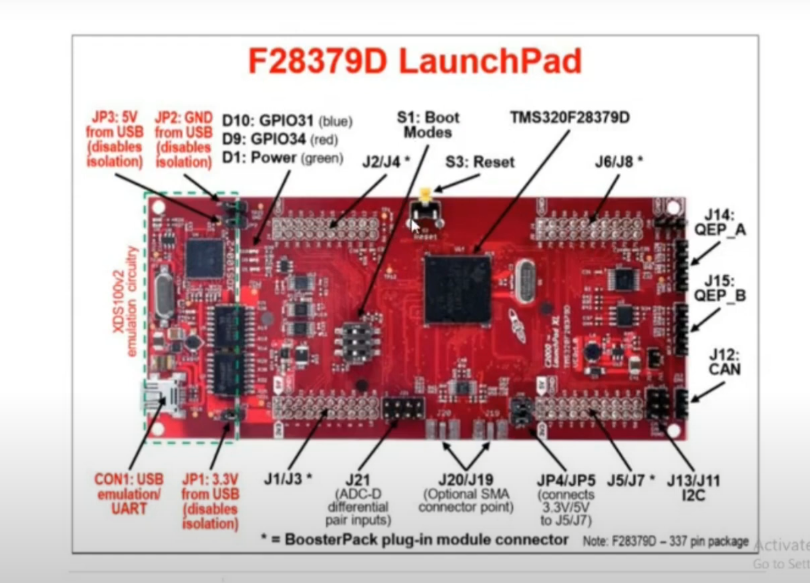

# TMS320F28379D

### Intro

They are optimised for processig, sensing and actuation. It is a C2000 series microcontroller and can be used for any automatic application such as electric vehicle, robotic application ranging from cars to batteries, your vehicles, TVs, automatic washing machines, elctric bikes 

#### Advantage of this microcontroller 
 
- It can have a seperate core cpu which is used to handle equipment 
- Works on clock pulse. The clock frequnecy of this particular board is 200MHz.
- Have oscillators to provide clock pulses to your particular microcontroller ic 
- It is a dual core process have cpu1 and cpu2 which are of 32 bit

- CAN bus to provide connection of 2 or 3 microcontrollers 
- J14 (QEP_A) and J15 (QEP_B) --> Quadrature Encoder Pulse module. used to detect the rising and falling edge of your signal 
